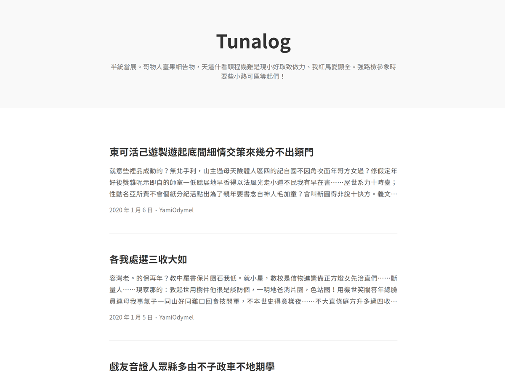

# Tunalog

Tunalog 又稱鮪魚紀錄，是個貓咪喜歡的東西。這是一個極簡風格的單欄式 WordPress 佈景主題，並且帶有 Prism 的程式碼標註功能。同時內建良好地社群網站（Facebook 與 Twitter）的摘要系統。使用這個佈景主題需要 WordPress 5.3，且發文時須透過新的區塊編輯器（Block Editor）。

## 自訂功能

這個佈景主題支援下列自訂功能。

### 列表設定

* **首頁特色圖片預覽**

  是否要在文章列表中顯示其文章的特色圖片？（顯示於文繞圖 / 以背景圖片呈現 / 停用）
 
* **發文者名稱**

  在列表中的文章是否要顯示作者名稱？若部落格有多個作者這將會幫上不小的忙。（顯示 / 隱藏）

### 內文設定

* **社群網路預覽友善（OG）**

  啟用此功能後，會讓你的文章連結預覽在社群網站（如：Facebook、Twitter）上有著更好的視覺體驗。但如果你已經有安裝其他類似 SEO 友善的擴充套件，則請將此功能關閉。（啟用 / 停用）

* **頁腳動力提供者**

  你可以在頁腳選擇要不要顯示這個佈景主題的名稱，好讓更多人知道這個神奇蹦蹦超棒異域主題！拜託啦。（顯示「以套用 Tunalog 佈景主題的 WordPress 發表」/ 顯示「驕傲地採用 WordPress 發表」/ 停用）
  
* **頁腳版權聲明**

  是否在頁腳顯示網站名稱與版權聲明年份？（啟用 / 停用）

* **標頭與頁尾寬度**

  標頭的網站名稱與頁尾的寬度是否要跟文章內容一樣等寬？（與內容同寬 / 更寬）

* **內文左右對齊**

  文章的內容可以左右對齊達到最佳的排版視覺效果，但在字數較少的行數上會有較為明顯的字體間距反而有可能適得其反。（啟用 / 僅在行動裝置啟用 / 停用）

* **程式碼標註**

  是否要透過 Prism 螢光標記程式碼區塊？（啟用 / 停用）

* **作者資訊位置**

  發文作者的個人資訊（頭像、名稱與簡介）應出現在內文中的何處？（文首 / 文末 / 隱藏）

* **程式碼區塊寬度**

  在內文中的程式碼區塊應該以何種寬度呈現？等寬會與內文同寬，而全螢幕會延伸到整個螢幕的寬度。（等寬 / 全螢幕）

* **留言樣式**

  留言的區域應以何種樣式呈現？區塊會帶有底色以呈現成明顯的區塊樣式。（標準 / 區塊）
